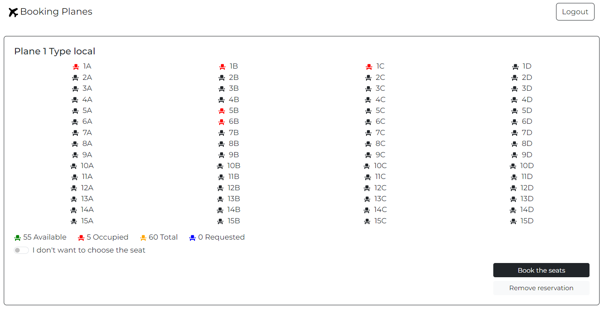

# Exam #2: "Airplane Seats"

## Student: s308455 COLAGIOVANNI SIMONE

# Server side

## API Server

- POST `/api/login`
  - body: email and user password
  - gives the opportunity to an user that has credentials to login
- POST `/api/logout`
  - give the oppurtunity to a logged in user to logout

### Pages and miscellaneous

- GET `/planes`
  - get all the info of the planes that exist
- GET `/planes/:id`
  - parameters: the id of a plane
  - return all the information about the plane that has the the id passed as parameter
- GET `/seats/:planeId`
  - parameters: the id of a plane
  - return all the information about all the seats that are occupied in the plane that as the id passed as parameter
- POST `/reservation/`
  - body: seatId and planeId
  - create a reservation on the plane with the id passed as parameter for the seat passed as parameter for the user that has the userId of the login
- PUT `/planes/:id`
  - parameters: the id of a plane
  - update the plane database after a reservation with the new number of occupied seats and available seats
- PUT `/planes/delete/:id`
  - parameters: the id of a plane
  - update the plane database after a reservation of the user that is logged in has been deleted
- DELETE `/reservation/delete`
  - parameters and body: none
  - delete the reservation made by the user that is logged
- GET `/reservation/count`
  - parameters and body: none
  - return the number of reservation made by the user that is logged

## Database Tables

- Table `users` - contains all the users info (email,password)
- Table `planes` - contain all the information about the planes (id, type, seat_occupied, seats_available, number of row of the plane, number of seats per row of the plane)
- Table `occupied_seat` - contains all the information about the occupied seats (seatId, planeId, userId)

# Client side

## React Client Application Routes

- Route `/`: Core route that wraps the header component for the other elements
- Route `""`: homepage route
- Route `/seats/:id`: plane page where i can see all the planes seats with all the info
- Route `/login`: login page
- Route `*`: not found page

## Main React Components

- `Header` (in `./components/Header.jsx`): component to display header of the page
- `Homepage` (in `./components/Homepage.jsx`): component to show the homepage with the recap of all the planes
- `PlanePage` (in `./components/PlanePage.jsx`): component to show the plane page with all the information about a specific plane
- `LoginForm` (in `./components/Login.jsx`): component to show the login page
- `PageNotFound` (in `./components/PageNotFound.jsx`): component to show the error page when the route is not found

# Usage info

## Example Screenshot

## Users Credentials

- simone.cola@gmail.com, 1234
- mario.rossi@gmail.com, polito2023
- paolo.bianco@gmail.com, planesbook2023
- max.allegri@gmail.com, prova2023
